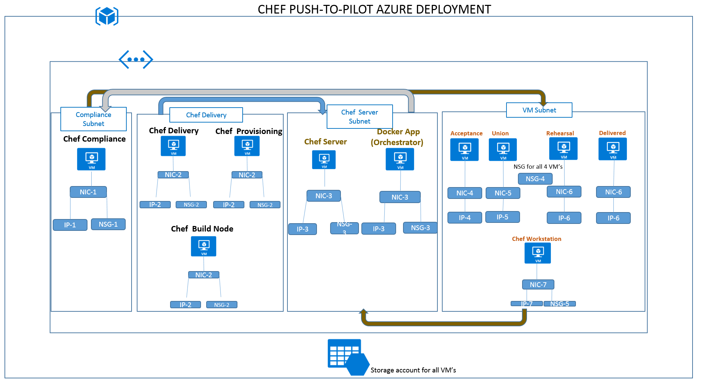
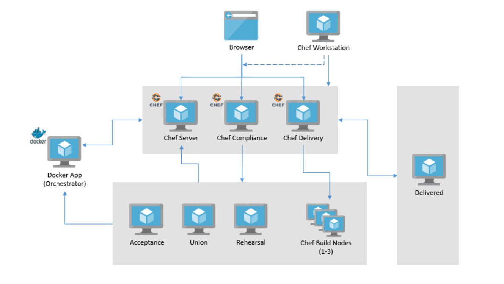
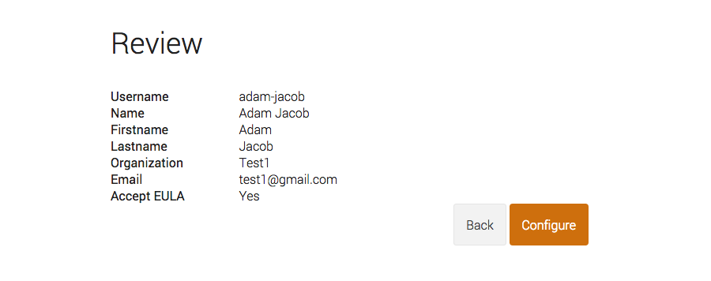
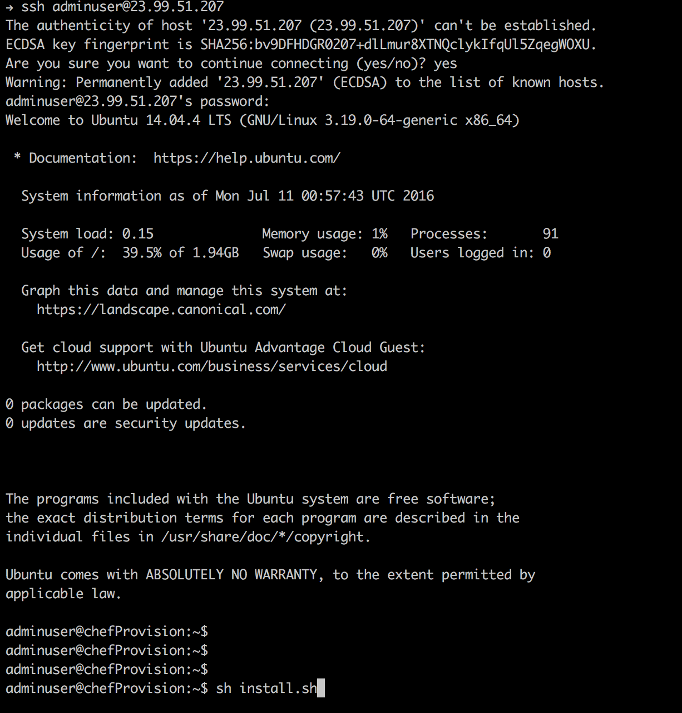
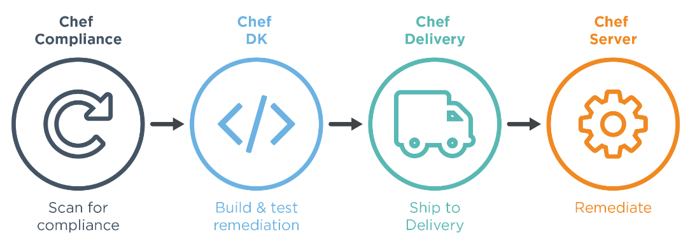

# Chef - Cloud Devops Solution Template
<a href="https://portal.azure.com/#create/Microsoft.Template/uri/https%3A%2F%2Fraw.githubusercontent.com%2FAzure%2Fazure-quickstart-templates%2Fmaster%2Fchef-automate%2Fazuredeploy.json" target="_blank">

</a>
<a href="http://armviz.io/#/?load=https%3A%2F%2Fraw.githubusercontent.com%2FAzure%2Fazure-quickstart-templates%2Fmaster%2Fchef-automate%2Fazuredeploy.json" target="_blank">

</a>

## Solution Template Overview
***Solution Templates*** provide customers with a highly automated process to launch enterprise ready first and 3rd party ISV solution stacks on Azure in a pre-production environment. The **Solution Template** effort is complimentary to the [Azure Marketplace test drive program](https://azure.microsoft.com/en-us/marketplace/test-drives/). These fully baked stacks enable customers to quickly stand up a PoC or Piloting environments and also integrate it with their systems and customization.

Customers benefit greatly from solution templates because of the ease with which they can stand up enterprise-grade, fully integrated stacks on Azure. The extensive automation and testing of these solutions will allow them to spin up pre-production environments with minimal manual steps and customization. Most importantly, customers now have the confidence to transition the solution into a fully production-ready environment with confidence.

**Chef end to end solution template** launches a devops stack that provides an automated provisioning, configuration and integration of multiple products ([Chef Server](https://azure.microsoft.com/en-us/marketplace/partners/chef-software/chef-server/), [Chef Compliance](https://azure.microsoft.com/en-us/marketplace/partners/chef-software/chef-compliance/) & [Chef Delivery](https://www.chef.io/delivery/)) that are needed for Continuous Delivery & compliance of application as well as infrastructure code.This is intended as a pilot solution and not production ready.
Please [contact us](azuremarketplace@sysgain.com) if you need further info or support on this solution.
##Licenses & Costs
In its current state, solution templates come with licenses built-in – there may be a BYOL option included in the future. The solution template will be deployed in the Customer’s Azure subscription, and the Customer will incur Azure usage charges associated with running the solution stack. There is a 30 day free version of chef delivery included with this stack.

Here we have provided trial license along with repo. it is advised to use new trial license or your license while deploying Automate [link to download Automate Key](https://learn.chef.io/automate/install/install-chef-automate/) (Click on 'Get a license' Button).

##Target Audience
The target audience for these solution templates are IT professionals who need to stand-up and/or deploy infrastructure stacks.
## Prerequisites
* Azure Subscription - if you want to test drive individual ISV products, please check out the [Azure Marketplace Test Drive Program ](https://azure.microsoft.com/en-us/marketplace/test-drives/)
* Azure user account with Contributor/Admin Role
* Sufficient Quota - 18+ Cores( with default VM Sizes)

## Solution Summary
The goal of this solution is to build out a complete Chef Solution Stack involving various components that are needed for Continuous Delivery & compliance of application as well as infrastructure code. This is achieved through various products from Chef.
* The core component for configuration & infrastructure management is achieved through Chef Server.
* Local Development of chef cookbooks can be performed using a workstation. This can be a developer’s own workstation. However, for simplicity we provide a workstation
* In order to continuously delivery chef cookbooks, Chef Automate is used.
* Multiple environments need to be created to show case the CD process and are managed by Chef Server & delivery. These include Build Nodes, Acceptance, Union, Rehearsal, and Delivered. These need to have chef agents installed and integrated with Chef Server. The Build nodes are directly managed by Chef Delivery
* To manage risk and compliance, Chef Compliance is used. With Chef Compliance you can scan for risks and compliance issues with easy-to-understand, customizable reports and visualization. You can then use Chef to automate the remediation of issues and use Chef Compliance to implement a continuous audit of applications and infrastructure.
* Chef Supermarket may also be deployed to store all the chef cookbooks.
* Chef Automate includes an Git Server for SCM.
This P2P allows customers to setup an end to end pilot solution in very short time.( less than 1.5 hours)
 
 
##Reference Architecture Diagram


###Chef Automate Components


The diagram above provides the overall deployment architecture for this solution.
As a part of deployment the template launches the following:
This Solution stack is deployed on Azure using the following Chef Products.
* Chef Server
* Chef Delivery
* Chef Compliance
It also deploys additional VMs to provide various environments to showcase a typical enterprise
* Build Nodes - These are managed by Chef Delivery
* Environments that chef need to manage
* Acceptance
* Union
* Rehearsal
* Delivered
A work station is also provided
Additionally, there is lot of integration that needs to be done among various components to make this an automated stack. For this purpose, a custom web service is built - Orchestrator - using Docker Containers.

A virtual network is created along with one storage account and four subnets to host all the services.
The first subnet hosts Chef Compliance node and is associated wth appropriate Public IP, Network Security groups
The second subnet hosts Chef Server and the orchestrator application. The Chef Server is built using the Chef Sever image from Azure marketplace and additional scripts manage the integration pieces. The orchestrator application is built as a RESTful web service on docker containers. Please note that at this time this is a HTTP service and is not intended for production deployments even though the node is internal. This can be backed by a key vault if needed for production deployments
The third subnet has all the nodes that are needed for chef delivery setup. A provisioning server is used to install the delivery cluster.
All the environments along with a chef workstation are hosted in the fourth subnet.

## Deployment Steps
***Please refer to parameter descriptions if you need more information on what needs to be provided as an input.***
The deployment takes about 1-1.5 hours.
The Deployment automation is divided into 3 steps

1. To deploy the Chef Automate stack user has to first deploy prereq.json, which deploys the VNET and required Subnets and storage accounts. It also deploys an instance of chef compliance from Azure Marketplace image. Once this template is deployed, the user needs to login to Chef Compliance web interface by providing the FQDN prefix, accept EULA and create an admin account. Please note down the user-id and password as this needs to be provided as an input to the next deployment.




(For security purposes the Chef Compliance setup wizard has a one hour timeout. If you try to create the users after this timeout, the setup page does not work. In this case, please follow the troubleshooting section [here](https://docs.chef.io/install_compliance.html).
2. The second deployment(azuredeploy.json) automates rest of the infrastructure provisioning configuration and installation of all the nodes .At the end of this deployment, all nodes as per the deployment diagram are created.

*Please note that it is important to provide the same user id and password while registering for Chef Compliance as an input to this template; otherwise the deployment will fail.*****

Input Parameters:


Resources created at the end of deployment:


### Chef Automate License
Login to Provision server and place Chef Automate License on the Provision server under adminuser home directory as delivery.license ( file can be transfered to destination host using any file transfer tools like winscp or filezilla) here we have provided trial license along with repo. it is best advised to use new trial license or your own license while deploying Automate [link to download Automate Key](https://learn.chef.io/automate/install/install-chef-automate/) (Click on 'Get a license' Button).

3. The final step is to log in to chef Provisioning Server using ssh client and run " sh install.sh" command. once this command run is completed, the delivery cluster is also setup. You can then run "sh delivery_credentials.sh" to retrieve the credentials for delivery node and delivery account on chef sever.
* Login to Provisioining node and run install.sh



* You should see output similar to the following at the end of the command run. This should take 5-10 mins.


* Run delivery_crendentials script to retrieve the credentials for Chef Server - delivery user and delivery UI.


##Post Deployment steps
Run all the listed commands to make Chef Automate fully functional
   ```shell
   Run folloing commands on Provisional server.
   1. wget https://raw.githubusercontent.com/boobalana/azure-quickstart-templates/master/chef-server-compliance-delivery-devops/scripts/chef_delivery_config.sh 
   2. cat chef_delivery_config.sh | ssh 10.7.3.7 bash
   3. wget https://raw.githubusercontent.com/boobalana/azure-quickstart-templates/master/chef-server-compliance-delivery-devops/scripts/chef_server_config_v2.sh
   4. cat chef_server_config_v2.sh | ssh 10.7.2.5 bash
   5. wget https://raw.githubusercontent.com/boobalana/azure-quickstart-templates/master/chef-server-compliance-delivery-devops/scripts/chef_nodes.sh
   6. cat chef_nodes.sh | ssh <env0-ipaddress> bash
   7. cat chef_nodes.sh | ssh <env1-ipaddress> bash
   8. cat chef_nodes.sh | ssh <env2-ipaddress> bash
   9. cat chef_nodes.sh | ssh <env3-ipaddress> bash
   
  Commands to be executed on Workstation
  10. Install Chefdk and git
         Invoke-WebRequest -UseBasicParsing https://raw.githubusercontent.com/Nordstrom/chefdk_bootstrap/master/bootstrap.ps1 | Invoke-Expression
         Install
  11. Install Chrome Browser.
         $LocalTempDir = $env:TEMP; $ChromeInstaller = "ChromeInstaller.exe"; (new-object    System.Net.WebClient).DownloadFile('http://dl.google.com/chrome/install/375.126/chrome_installer.exe', "$LocalTempDir\$ChromeInstaller"); & "$LocalTempDir\$ChromeInstaller" /silent /install; $Process2Monitor =  "ChromeInstaller"; Do { $ProcessesFound = Get-Process | ?{$Process2Monitor -contains $_.Name} | Select-Object -ExpandProperty Name; If ($ProcessesFound) { "Still running: $($ProcessesFound -join ', ')" | Write-Host; Start-Sleep -Seconds 2 } else { rm "$LocalTempDir\$ChromeInstaller" -ErrorAction SilentlyContinue -Verbose } } Until (!$ProcessesFound)

  12. git config --global user.email "adminuser@sysgain.com"
  13. git config --global user.name "adminuser"
  14. Launch chef automate from browser (https://10.7.3.7/e/testchef/#/dashboard)
            i)   click on Admin tab
            ii)  Select +Newuser 
            iii) Fill all the details (leave ssh key black and select all check boxes) and Save.
  15. Select Workflow tab
            i)   Click Workflow Orgs on right side
            ii)  Fill in organisation name : adminorg
            iii) Click on Save&Close
  16. Generate ssh key          
            i) ssh-keygen (accept default)
  17. Copy generated key to automate
            i)   Open Automate page (https://10.7.3.7/e/testchef/#/users) 
            ii)  Select the newly created user (adminuser)
            iii) Copy public key (C:\Users\<user>\.ssh\id_rsa.pub) and paste it under SSH key
            iV)  Click on Save & Close
   18. Autenticate User
            ssh -l adminuser@testchef 10.7.3.7 -p 8989 (Ensure you get sucessfully authenticated )
   19. Setup Starter kit
            i) Access Chef URL from browser.
           ii) Select Administration tab
          iii) Select testchef Click dropdown on right end and select Starter kit
           iv) Click Download Starter Kit
            v) Click Proceed
	          vi) Extract the downloaded file and place 'chef-repo' under  "C:\Users\<user>\"
    20) Check chef server connectivity ( from powershell)
           i) navigate to 'chef-repo' folder 
          ii) execute 'knife ssl fetch' (since we are adding it manually we need to make it listen to server).
         iii) execute 'knife node list' (should fetch all associated servers).       
    21) Generate cli.toml
           i)  create '.delivery' folder  ((C:\Users\<user>\.delivery)
	                      mkdir c:\users\<user>\.delivery
	         ii) create 'cli.toml' file ((C:\Users\<user>\.delivery\cli.toml)) and update contect accordingly as shown below.
	                     New-Item c:\users\<user>\.delivery\cli.toml -ItemType file
					          -------------------------------
                user = "adminuser"
                organization = "adminorg"
                enterprise = "testchef"
                server = "10.7.3.7"
                api_protocol = "https"
                git_port = "8989"
                pipeline = "master"
           ------------------------------- 		
     22) Copy C:\Users\<user>\chef-repo\.chef\* to C:\Users\<user>\.chef\
     23) Create 'config.json' under "C:\Users\<user>\.berkshelf\" with following content 
                     New-Item C:\Users\adminuser\.berkshelf\config.json -ItemType file
			             -------------------
             {"ssl": {"verify": false}}
             --------------------
     24) Download following repo
             https://github.com/USGS-CIDA/stig/archive/v0.5.4.zip
             https://github.com/chef-cookbooks/audit/archive/v0.14.3.zip
             https://github.com/binamov/audit_wrapper/archive/master.zip
       
     25) Extract all downloaded repo and place it under 
             C:\Users\adminuser\chef-repo\cookbooks  
     
     26) navigate to  C:\Users\<user>\chef-repo\cookbooks\audit_wrapper-master from powershell
             berks install
             berks upload
     27) Execute chef-client on all associated nodes from workstation.
             knife ssh name:Environment-node0 -a ipaddress -x adminuser 'sudo chef-client'
             knife ssh name:Environment-node1 -a ipaddress -x adminuser 'sudo chef-client'
             knife ssh name:Environment-node2 -a ipaddress -x adminuser 'sudo chef-client'
             knife ssh name:Environment-node3 -a ipaddress -x adminuser 'sudo chef-client'
      
     Commands to be executed on Chef Server
    
    28) sudo dpkg -i /tmp/chef-gate-latest.deb
    29) sudo chef-server-ctl reconfigure
    30) Modify '~/etc/opscode/chef-server.rb' # add to the bottom of ~/etc/opscode/chef-server.rb <change compliance server fqdn for redirect_uri>"

                    oc_id['applications'] ||= {}
                    oc_id['applications']['chef_gate'] = {
                          'redirect_uri' => 'https://compliancrg302.westus.cloudapp.azure.com/auth/oc_id/callback'
                      }
                      oc_id['administrators'] = ['admin']

   31) Modify '/var/opt/opscode/nginx/etc/addon.d/50_compliance_upstreams.conf' <change Compliance Server>
                      #add to /var/opt/opscode/nginx/etc/addon.d/50_compliance_upstreams.conf
                      #
                      # Chef Compliance upstream definition
                      #
                      upstream compliance {
                           server compliancrg302.westus.cloudapp.azure.com:443; # for compliance behind its nginx (incl. TLS)
                      }

   32) sudo chef-server-ctl restart nginx
   33) sudo vi /opt/opscode/sv/chef_gate/env/CHEF_GATE_CHEF_SERVER_URL  (add chef server https://chefserver))
   34) sudo vi /opt/opscode/sv/chef_gate/env/CHEF_GATE_OIDC_ISSUER_URL   (add chef compliance https://chefcompliance)
   35) sudo vi /opt/opscode/sv/chef_gate/env/CHEF_GATE_COMPLIANCE_SECRET (assign a secret value)
   36) sudo /opt/opscode/embedded/bin/sv stop chef_gate   
   
   Commands to be executed on Chef compliance 


  37) Login to compliance server (ssh 10.7.1.99).
  38) sudo vi /opt/chef-compliance/sv/core/env/CHEF_GATE_COMPLIANCE_SECRET (assign a same secret value provided in above step)
  39) sudo chef-compliance-ctl restart core
  40) sudo cp /opt/chef-compliance/sv/core/env/OIDC_CLIENT_ID /tmp
  41) sudo chmod 755 /tmp/OIDC_CLIENT_ID
  42) scp  /tmp/OIDC_CLIENT_ID <Chef_server>:/tmp/.
  43) exit 


Commands to be executed on Chef Server

 Login to chef server
 44) sudo cp /tmp/OIDC_CLIENT_ID /opt/opscode/sv/chef_gate/env/CHEF_GATE_OIDC_CLIENT_ID
 45) sudo /opt/opscode/embedded/bin/sv restart chef_gate

   ```
##Usage
#### Connect
This solution can be used to continuously delivery you application as well as infrastructure code. You can follow the chef workflow to accomplish this.
One workflow is to contiuously delivery you chef cookbooks to build and manage infrastructure and application configuration. More details are provided on the chef website.


Beginning with the Chef Compliance server, you can scan your nodes to see if they are compliant and their software is up to date. You'll receive a report telling you the status of your infrastructure. Once you have the report, you can use Chef DK to begin to build and test the remediation. Chef DK contains all the tools you need to create and test your code on your workstation.
You can then send your changes to Chef Delivery. Chef Delivery provides a pipeline for deploying changes. The pipeline contains stages for testing your changes and making sure they work. Within the pipeline are two manual gates. One of them is for code review, and the other sends the code to the release environments. In keeping with the DevOps approach, you can involve compliance and security officers at either or both of these points to make sure they are actively engaged in the release process.
Tutorials are docs are provided [here](https://learn.chef.io)

### Known Limitations & Issues
1. Current VMadmin username for chef delivery nodes ( chef delivery, chef provisioning, build nodes) are hardcoded to be adminuser
2. The Orchestrator service only supports HTTP and is internal to the VNET, so no authentication is implemented. This is intended for pilot installations. For Production implementations, a more secure solution should be integrated with or this application can be updated to work with keyVaults.
3. Currently deployment only allows access to chef delivery web UI from a workstation on the internal network. You can use the workstation provided in the deployment to access the UI.
4. The current key pair for delivery cluster is reused across multiple deployments. You can always copy your private key to Chef Provisioning server and public keys to Chef Server, Chef Build node and Chef delivery server. However, please note that the key pairs are unique per deployment for Chef Server Validaton.pem and Chef Compliance.


##Support
For any support-related issues or questions, please contact azuremarketplace@sysgain.com for assistance.
